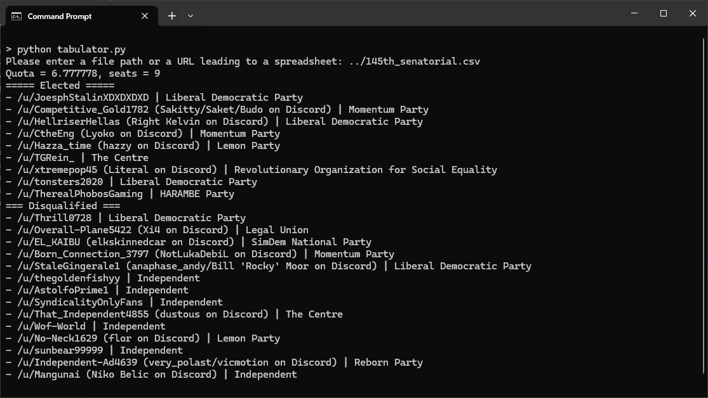
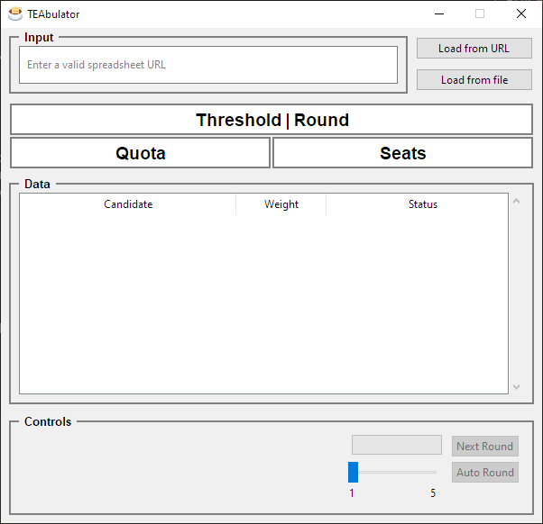
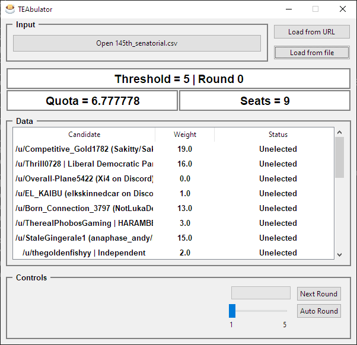

# TEAbulator

A tabulator for the TEA (Threshold Equal Approval) voting method created by [@bternarytau](https://github.com/bternarytau).

## How does TEA work?

Voters will give each candidate an integer score between 0 and 5, with 0 being the lowest and 5 being the highest. Blank scores are also permitted and will be counted as 0s.

Tabulation will proceed as follows:

1. Initialize the threshold to a score of 5. Initialize each ballot's weight to 1. Inrritialize the quota to the total number of ballots cast divided by the total number of available seats.
2. Identify all unelected candidates scored at or above the threshold on ballots with a total weight of at least a quota. If there are no such candidates, go to step 4. Otherwise, for each such candidate and the set of ballots that scored that candidate at or above the threshold, calculate the value n such that the sum of `min(w, n)` for all ballots in the set is equal to one quota, where _w_ is the weight of each ballot. Elect the candidate with the least value of _n_, and reduce the weight of each ballot in that candidate's set by `min(w, n)`.
3. If all seats are filled, tabulation is complete. Otherwise, go to step 2.
4. If the threshold is greater than 1, then reduce it by 1 and go to step 2.
5. Elect the candidate with the greatest sum of ballot weights across all ballots that give them a positive score. Set the weight of each ballot that gives them a positive score to 0.
6. If all seats are filled, tabulation is complete. Otherwise, go to step 5.

[More information is provided at the Appendix of the SimDemocracy Constitution](https://qwrky.dev/mediawiki/index.php/Constitution#Part_8:_Appendix)

## Command-line usage

Command-line support is currently limited in output and functionality, as it will only output elected and disqualified candidates after all tabulation rounds are complete.

1. [Install TEAbulator as specified in the installation section](#installation)
2. Run: `python tabulator.py`
3. You will be instructed to input a filename or a URL pointing to a `.csv` file for the spreadsheet you wish to tabulate. Dragging and dropping your file onto the terminal should suffice in entering the file path, but if that fails you may enter the absolute (_C://..._) or relative (_../../_) filepath of your `.csv` file manually.
> Take special care to backslashes on Windows. Entering a relative filepath like _..\my_tea_data.csv_ will result in the following error: `FileNotFoundError: Invalid spreadsheet file or URL: ..\my_tea_data.csv`

4. A list of elected and disqualified should appear as shown below.



## Graphical usage

TEAbulator comes with a graphical interface in order to tabulate visually. This interface is more complete than it's command-line counterpart, as it allows you to view the tabulation round by round with visual cues as to who is elected, and who is disqualifed.



There are two methods in which you can access the graphical interface, running the interface as a Python script and building the app into an executable. Details on how to use the graphical interface through any of the two methods are listed below under each method's appropriate heading.

### Loading the tabulator

You may load the tabulator either through **Load from file**, which will prompt you to select the spreadsheet file and begin loading straight away, or **Load from URL**, the default selection, which will prompt you to enter a URL pointing to a `.csv` file for the spreadsheet you wish to tabulate, and will only begin loading once you press Enter.

If everything goes smoothly, the table should be populated, in addition to the values of the threshold, quota and seats appearing as shown below.



## Installation

**TEAbulator requires Python 3.12 or later.**

1. Clone the repository. Make the cloned folder your working directory.
2. (Optional) Initalize a virtual environment through
```
python -m venv venv
```
Then activate it. Activation varies on platform, and thus you can find more information on how to activate your virtual environment from the [Python Packaging User Guide](https://packaging.python.org/guides/installing-using-pip-and-virtual-environments/#create-and-use-virtual-environments).

3. Install the required packages through
```
python -m pip install -r requirements.txt
```

4. Once all the packages are installed, you can run TEAbulator through the command-line or graphical interface.